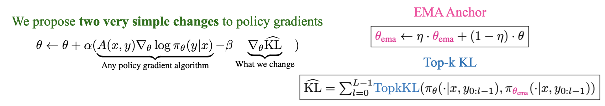
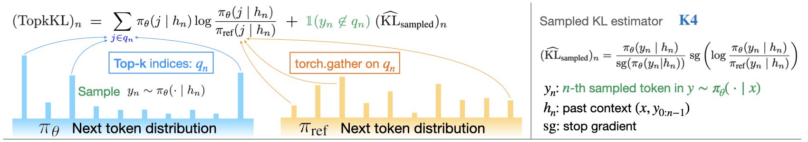
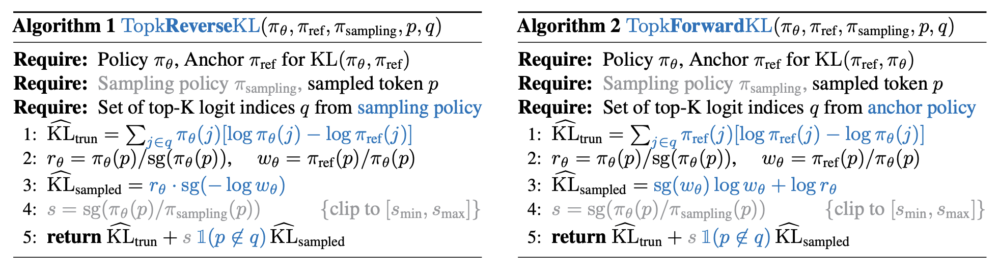
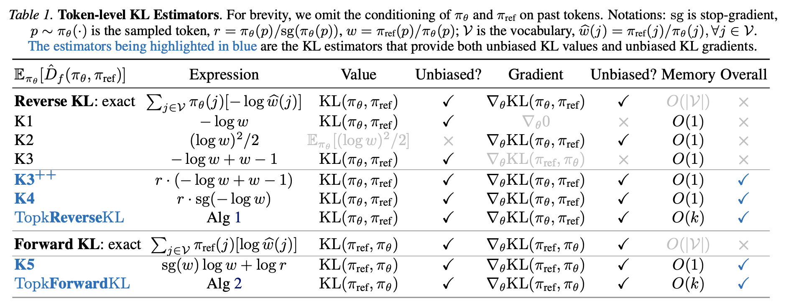

<h2 align="center">
  EMA Policy Gradient:<br/>
  Taming Reinforcement Learning for LLMs with EMA Anchor and Top-k KL
</h2>

<p align="center">
  <a href="https://lunjunzhang.github.io/">Lunjun Zhang</a>,
  <a href="https://jimmylba.github.io/">Jimmy Ba</a>
</p>

🔗 arXiv: https://arxiv.org/abs/2602.04417

## TL;DR

EMA-PG improves reinforcement learning for LLMs with two simple techniques: **(1) EMA Anchor** replaces fixed reference policies with an exponential moving average, and **(2) Top-k KL** provides memory-efficient KL estimation with unbiased gradients. We demonstrate improvements on math reasoning and agentic search benchmarks.

## Table of Contents

- [Overview](#overview)
- [Requirements](#requirements)
- [Quick Start](#quick-start)
- [Top-k KL Implementation](#top-k-kl-implementation)
- [Experiments](#experiments)
  - [Search (NQ, HotpotQA)](#experiments-on-search-datasets)
  - [Math (AIME)](#experiments-on-math-datasets)
- [Citation](#citation)
- [License](#license)

## Overview



Reinforcement Learning (RL) has enabled Large Language Models (LLMs) to acquire increasingly complex reasoning and agentic behaviors. In this work, we propose two simple techniques to improve policy gradient algorithms for LLMs. *First*, we replace the fixed anchor policy during RL with an Exponential Moving Average (**EMA**), similar to a target network in deep Q-learning. *Second*, we introduce **Top-k KL estimator**, which allows for flexible interpolation between exact KL and sampled KL.



Our Top-k KL estimator yields both unbiased KL values and unbiased gradients at any k, while bringing the benefits of exact KL.

## Requirements

- **Full training**: 8x H100 GPUs (80GB)
- **Python**: 3.9+ (search) / 3.10+ (math)
- **CUDA**: 12.1+

## Quick Start

### Search Experiments

```bash
cd search
pip install -e .
bash train_grpo_ema_pg.sh
```

See [`search/README.md`](search/README.md) for detailed setup (retriever environment, dataset preparation).

### Math Experiments

```bash
cd math
pip install -e .[verl]
bash examples/deepscaler/train_deepscaler_8k_ema_pg.sh
```

See [`math/README.md`](math/README.md) for detailed setup and multi-stage training.

## Top-k KL Implementation

The key insight of Top-k KL is to only **partially compute exact KL on the top-k logit indices** of the policy under which the expectation is taken (which is current policy for reverse KL, reference policy for forward KL), and then use a **partially masked sampled KL to correct for the tail** of the distribution, so that we arrive at an unbiased estimator for KL values and gradients, with lower variance than sampled KL.

Top-k KL is implemented in [core_algos.py](search/verl/trainer/ppo/core_algos.py) as the `compute_memory_efficient_kl` function. It supports both Forward KL and Reverse KL in `kl_type` argument: "full_forward" for KL(π_ref || π) or "full_reverse" for KL(π || π_ref).



We typically set `kl_topk_tokens=32`, which is the k in Top-k.

Besides, we also introduced 3 additional sampled KL estimators: **K3**++ and **K4** for *reverse* KL, **K5** for *forward* KL. Different from prior sampled KL estimators (K1, K2, K3), our estimators can provide both unbiased KL estimates and unbiased KL gradients. Those estimators are implemented in [core_algos.py](search/verl/trainer/ppo/core_algos.py) inside the `kl_penalty_forward` function.



Besides `compute_memory_efficient_kl`, Top-k KL requires two additional components in the implementation:
 - Getting the top-k indices from the logits of each NTP distribution. This was computed in `_forward_micro_batch_with_logits` in [dp_actor.py](search/verl/workers/actor/dp_actor.py).
 - Gathering from top-k indices. This was also computed in the same function via indexing.
 - For reverse KL, the expectation is taken under π, so the top-k indices are computed from π_old. For forward KL, the expectation is taken under π_ref, so the top-k indices are computed from π_ref.

In settings like online RL / on-policy knowledge distillation, using Top-k KL with *tail correction* (the partially masked sampled KL) matters; for offline knowledge distillation, one may simply use Truncated KL (by setting `kl_use_tail_sampling=false`), which offers an offline variant of Top-k KL that does not require sampling from the student.

## Experiments

### Experiments on Search Datasets

See `./search/` folder: set up the training environment and prepare datasets according to the instructions; `train_grpo_ema_pg.sh` provides an example training script.

The following script requires 8 H100s on a single node:
```bash
HYDRA_FULL_ERROR=1 NCCL_NET=Socket bash scripts/nq_hotpotqa/v0.2/train_grpo_3b_base_ema_pg.sh
```

To use EMA Anchor, you need to set ema_tau to be smaller than 1.0. We also recommend setting ema_update_period to be 10, which controls how often the EMA is being updated:
```bash
+algorithm.ref_policy_ema_tau=0.9 \
+algorithm.ref_policy_ema_update_period=10 \
```

To use Top-k KL:
```bash
actor_rollout_ref.actor.kl_loss_type=full_reverse \
actor_rollout_ref.actor.kl_topk_tokens=32 \
actor_rollout_ref.actor.use_kl_iw=true \
```

Evaluation script is the same as the training script.

### Experiments on Math Datasets

See `./math/` folder: set up the training environment and prepare datasets according to the instructions; the training and eval scripts are provided in the `examples/deepscaler` folder.

Example commands on a node of 8 H100s:
```bash
NCCL_NET=Socket bash examples/deepscaler/train_deepscaler_8k_ema_pg.sh

RESUME_FROM_PATH=/home/ema-pg/math/checkpoints/rllm-agent/deepscaler-1.5b-8k-ema-pg/global_step_480 NCCL_NET=Socket bash examples/deepscaler/train_deepscaler_16k_ema_pg.sh

RESUME_FROM_PATH=/home/ema-pg/math/checkpoints/rllm-agent/deepscaler-1.5b-16k-ema-pg/global_step_800 NCCL_NET=Socket bash examples/deepscaler/train_deepscaler_24k_ema_pg.sh
```

We provide the final checkpoint [here](https://huggingface.co/lunjun/math-qwen-1.5b-ema-pg/tree/main). To run eval, download the eval datasets using `prepare_all_math_data.py`; then, convert the checkpoint to the huggingface format:
```bash
python -m verl.model_merger merge --backend fsdp --local_dir /home/math-qwen-1.5b-ema-pg/actor --target_dir /home/math-qwen-1.5b-ema-pg/actor_hf
```
Next, generate the model rollouts:
```bash
NCCL_NET=Socket python examples/deepscaler/generate_benchmarks_openai.py --model_path /home/math-qwen-1.5b-ema-pg/actor_hf --output_path ~/data/benchmark_results.parquet --seed 429 --temperature 0.8 --top_p 0.9 --max_tokens 28000 --base_url http://localhost:30000/v1 --n_parallel_agents 64 --n_samples 32
```
Finally, compute the eval results from rollouts and save the results:
```bash
python examples/deepscaler/evaluate_benchmarks.py --input_path ~/data/benchmark_results.parquet --output_path ~/data/benchmark_results.json
```

## Citation

If you find our work to be useful, consider citing us:

```bibtex
@article{ema-pg,
  title         = {EMA Policy Gradient: Taming Reinforcement Learning for LLMs with EMA Anchor and Top-k KL},
  author        = {Zhang, Lunjun and Ba, Jimmy},
  journal       = {arXiv preprint arXiv:2602.04417},
  year          = {2026}
}
```

## License

This project is licensed under the MIT License.
